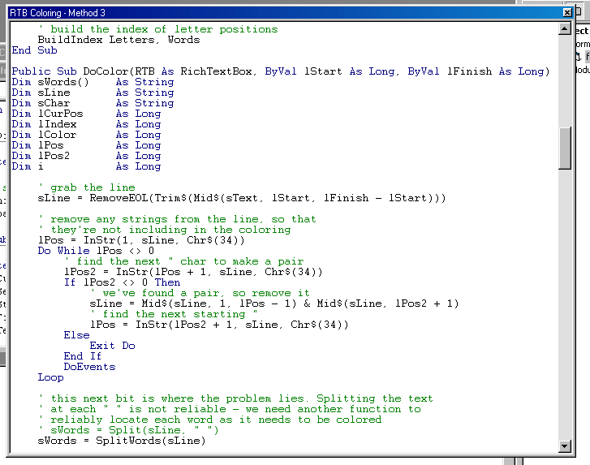



## \_ RichTextBox Coloring: A Complete Tutorial \_

### Description

The purpose of this text is to attempt to answer the incessant queries on coloring text in RichTextBoxes. There is no magic command to do so, unless of course you have purchased a third party control from somewhere or other. There are plenty around, and some are cheap, some are not...

Please read the article, download and enjoy the code. I'd appreciate a little feedback, and maybe a vote? Just so I know which bits are good, which aren't, and which i've left out. Thanks =)

Update [15/10/02]: Fixed first line bug - thanks Rob =)
 
### More Info
 

             |
---                |---
**Submitted On**   |2002-10-14 21:19:56
**By**             |[Will Barden](https://github.com/Planet-Source-Code/PSCIndex/blob/master/ByAuthor/will-barden.md)
**Level**          |Intermediate
**User Rating**    |4.8 (176 globes from 37 users)
**Compatibility**  |VB 5\.0, VB 6\.0
**Category**       |[Miscellaneous](https://github.com/Planet-Source-Code/PSCIndex/blob/master/ByCategory/miscellaneous__1-1.md)
**World**          |[Visual Basic](https://github.com/Planet-Source-Code/PSCIndex/blob/master/ByWorld/visual-basic.md)
**Archive File**   |[\_\_RichText14657110152002\.zip](https://github.com/Planet-Source-Code/will-barden-richtextbox-coloring-a-complete-tutorial__1-39824/archive/master.zip)

### Source Code

<html>
<head>

</head>
<body>
<h1>Welcome, all you fans of RTB coloring...</h1>
<table width=600>
	<tr>
	<td>
With any luck - here your questions will be answered. Included with this short text are three folders,
"Method1", "Method2", and "Method3". Each folder employs a new technique, or a new slant on a technique
over the previous one, and they get more complex down the line... There is a "Method4" in production,
but it may take some time... =)

The purpose of this text is to attempt to answer the incessant queries on coloring text in RichTextBoxes.
There is no magic command to do so, unless of course you have purchased a third party control from
somewhere or other. There are plenty around, and some are cheap, some are not...

I have demonstrated very simply the two methods I think are the easiest: the first is what everybody
tries to begin with, the second is a simulation of Microsofts VB IDE style (Bear in mind, it might
not be the same method, but it's the same effect). Method 3 is new and is a more complex and more
efficient version of Method 2, with a slight twist. So, without further ado.. onto the explanations.

	</td>
	</tr>
	<tr>
	<td>
<h2>Method1</h2>
Simply the easiest way really - color all the text every time a user presses a key within your RichTextBox
 (RTB). "But how?!" I hear you cry.. well here goes the basics:

<pre>
RTB.SelStart = 1 ' this is the starting position of the selection in the RTB
RTB.SelLength = 10 ' this is how many characters are selected, and thus how many are colored
RTB.SelColor = vbRed ' this is the color to set the selection to
</pre>
There you have it, you've just colored the first 10 characters in your textbox - fun wasn't it? :)

Now, this method is slightly more complex than that. You will obviously want to have different words
as different colors, and some maybe not colored at all. Well, to do this, you must create an array of
words, and the colors to be associated to them. You could have two seperate arrays, but this is where
I think Types come in quite handy:
<pre>
Type WORD_TYPE
 Text As String
 Color As Long
End Type
Dim Words() As WORD_TYPE
</pre>
As you can see, you now have an array of words and colors to go with them. Once you've initialised the
array to hold the values you want, we can begin coloring...

So, all you have to do now is go through all the text in your textbox, and match all the instances of
these words, then use the method above to color them.
<pre>
 ' go through each item in the Words array
 For i = LBound(Words) To UBound(Words)
 ' find each instance of the word in the rtb
 p1 = InStr(1, Text, Words(i).Text)
 Do While p1 > 0
  ' color it to the appropriate color
  RTB.SelStart = p1 - 1
  RTB.SelLength = Len(Words(i).Text)
  RTB.SelColor = Words(i).Color
  ' go on to the next word
  p1 = InStr(p1 + 1, Text, Words(i).Text)
 Loop
 Next i
</pre>
You would perform this operation in the KeyUp() event of your RTB - but before you do, there is one more
little thing to remember. Because your coloring routine is going to move the SelStart (the position of
the mouse cursor within the RTB) around all over the place, your user is not going to be able to type.
Obviously you don't want this - so store the position of the cursor before you do the coloring, then
restore it again afterwards. You will also need to restore the default color because it will have been
changed as well...
<pre>
 ' store the current cursor pos
 lCursor = RTB.SelStart
 ' do the coloring
 DoColor RTB
 ' reset the cursor
 RTB.SelStart = lCursor
 ' restore the color
 RTB.SelColor = vbBlack
</pre>
That's it for method one - open the "Method1" folder, run the project and examine the code. You will notice
that although it looks great when you open it up, it is impossible to use.

	</td>
	</tr>
	<tr>
	<td>
<h2>Method2</h2>
Method 2 is slightly more complex. It's not hard to understand though - here goes:

When a user is typing in your RTB, only one line of text is being altered (normally only one word of text
at a time as well, but we'll leave that for now..). As such, you only really need to color that single line
and not the entire box as we were doing before.

Also, there is no need to color the line if nothing has changed, so checking which key has been pressed in
the KeyDown() event rather than the KeyUp() event will sort that out. 

Finally - as Microsoft does in the VB IDE, we don't really need to color the line until the user moves the
cursor off it - this means one quick operation once per line, rather than twenty times as the user types
it all out.

The actual coloring routine is remarkably similar, this handling is done outside of it really. The only
extra bits the coloring routine needs to know are where to start coloring from (the beginning of the current
line) and where to stop (the end of the current line). We can find this out with a couple of Instr() calls.

<pre>
  ' store the current cursor pos
  ' and current selection if there is any
  lCursor = RTB.SelStart
  lSelectLen = RTB.SelLength
  ' get the line start and end
  lStart = InStrRev(RTB.Text, vbCrLf, RTB.SelStart + 1) + 2
  lFinish = InStr(RTB.SelStart + 1, RTB.Text, vbCrLf)
  If lFinish = 0 Then lFinish = Len(RTB.Text)
  ' do the coloring
  DoColor RTB, lStart, lFinish
  ' reset the cursor
  RTB.SelStart = lCursor
  RTB.SelLength = lSelectLen
  ' restore the color
  RTB.SelColor = vbBlack
	 ' flip the flag
  bDirty = False
</pre>
As you can see, as well as storing the cursor position, we've also stored the selection - this means that the
coloring routine is completely transparent, the user is unaware of it. Also, we use a bDirty flag to store
whether the current line has been altered, and therefore whether it needs coloring or not.

Lastly, as a little kicker - we're going to emulate MS even more and remove all coloring from a line when it is
altered, or made "dirty". This is again, done in the KeyDown() sub, not the coloring routine.

<pre>
 ' a different key was pressed - and
 ' this will alter the line so it
 ' needs recoloring when we move off it
 bDirty = True
 ' remove all coloring from this line
 ' as a visual reminder to the user
 ' that it has been changed
 ' get the line start and end
 lStart = InStrRev(RTB.Text, vbCrLf, RTB.SelStart + 1) + 2
 lFinish = InStr(RTB.SelStart + 1, RTB.Text, vbCrLf)
 If lFinish = 0 Then lFinish = Len(RTB.Text)
 ' color the line (remembering the cursor position)
 lCursor = RTB.SelStart
 RTB.SelStart = lStart
 RTB.SelLength = lFinish - lStart
 RTB.SelColor = vbBlack
 RTB.SelStart = lCursor
</pre>
The coloring routine itself only has a couple of minor changes, so that it only searches between the passed
start and finish parameters. Also, the initial coloring of the text in the Form_Load() event is slightly
different as well, because each line must be passed to the DoColor() sub individually.

Aside from those differences, it is pretty much the same.

	</td>
	</tr>
	<tr>
	<td>
<h2>Method 3</h2>
So, method 3. It's slightly more complex, so I'll explain. The previous methods worked via a brute force
technique. The code would run through the list of words, and color them all in the text. This method works
the other way around. It takes the line it's been passed to color, splits it up into words, then checks
each word against the list of keywords (that are sorted) to find a match. 

To start with, you might think this has little difference, but with a little tweak here, a little tweak
there, great advances can be made. The other parts are the same - this only colors one line at a time,
and as each line is made 'dirty' it is colored black so that the user knows it's been changed.

Firstly, the array of keywords is sorted alphabetically. This means that rather than looping through the
entire array to locate a word, we can perform a standard binary search algorithm on the array to locate
the item faster. It has been shown that a binary search is an effective algorithm for locating items
in a sorted array.

To further speed up this search, we can build an index on the sorted array. This index will store the begin
and end positions of each letter in the array. For example, if words beginning with the letter "B" begin at
words array element 2, then the "B" letter continues until words array element 4 and we know these positions,
we can greatly reduce the number of elements that the binary search has to compare.
<pre>
Private Type LETTER_TYPE
 Start As Long
 Finish As Long
End Type
 Words(0) = "And"
 Words(1) = "As"
 <b>Words(2) = "Byte"</b> ' starts at 2
 <b>Words(3) = "ByRef"</b> '
 <b>Words(4) = "ByVal"</b> ' ends at 4</b>
 Words(5) = "Else"
 Words(6) = "End"
' so the LETTER_TYPE for "B" would be as follows:
' Letter.Start = 2
' Letter.Finish = 4
</pre>
After each word is seperated, the first character is extracted and used to look up the start and finish
positions in the index array. Then these values are passed into the search routine. The effect of this
indexing method will become more apparent with larger arrays of keywords. I would hope that the speed
drop would be very slight as the keyword list got larger.. but only tests will tell.

So this is fine, but one other major problem remains. How do we decide which elements in the line to be
color are seperate? The obvious method would be to use the <b>Split()</b> function to split the line at
each space character (" ", Chr(34)). On closer inspection though, this won't work. For example, it wouldn't
recognise "ByVal" in the following line:
<pre>
 Private Sub Moo(ByVal sParam As String)
</pre>
So, a new function is devised. This new <b>SplitWords</b> function will split at the nearest word break
character, which can be one of several - " ", "(", ")", "'", ";", "<" etc... at present, there is no
noticeable speed drop.

The final problem with these selection methods is the flickering of the line whilst it's being colored.
On multiple suggestions, I've implemented the LockWindowUpate API, which means that the flicker on
each line is reduced, however, on my machine, the whole RTB flickers sometimes. This is a better trade
off though.
	</td>
	</tr>
	<tr>
	<td>
<h2>Conclusion</h2>
You will notice (hopefully) that Method 1 is not at all usable. The RTB scrolls horribly whilst typing, and
flickers beautifully while scrolling, which would induce most end-users into a fit of rage or an epilleptic fit.
Method 2 on the other hand is doing much less work, much less often, making it perfectly usable in its current
state. Method 3 is very usable, if you don't mind the tiniest bit of flicker when changing lines. It is fast to
color large blocks though, going at about 90KB/sec on my machine.

There are a couple of problems though - at present, Methods 1 and 2 only recognise VB comment lines if they
start as a comment line, not if the line is hybrid code and comment. Also, there are only a few keywords in the
array. However, since this was not meant as a working drop-in component, I'll leave them to you to fix.
Method 3 is seemingly complete, and fixes many many logic bugs in the first two methods (coloring text
pasted into the RTB is a major one)... but there is still one problem. Flicker. The flicker that comes
with using a selection method. Even with the LockWindowUpdate API, there is still flicker... =(

Method 4 is in production, and involves converting Method 3 to alter the RTF of the box, rather than the
selection... also fixing the last logic bugs (Undo, Redo etc)... fingers crossed eh?

	</td>
	</tr>
<table>
</body>
</html>

